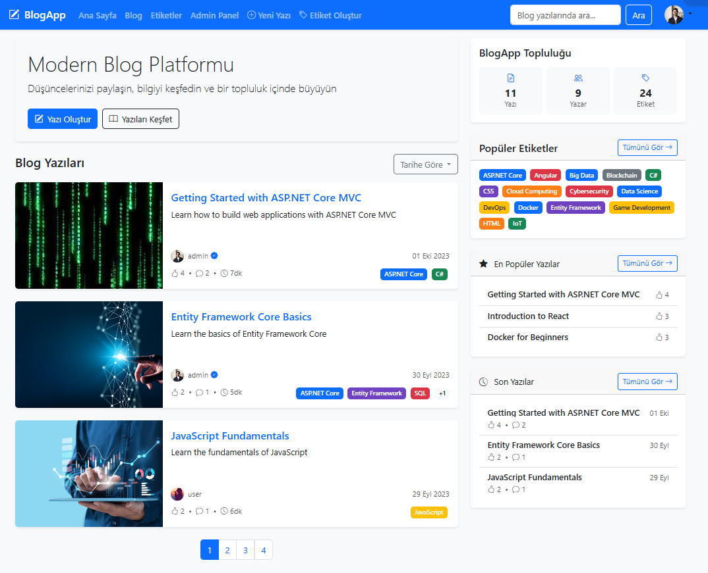
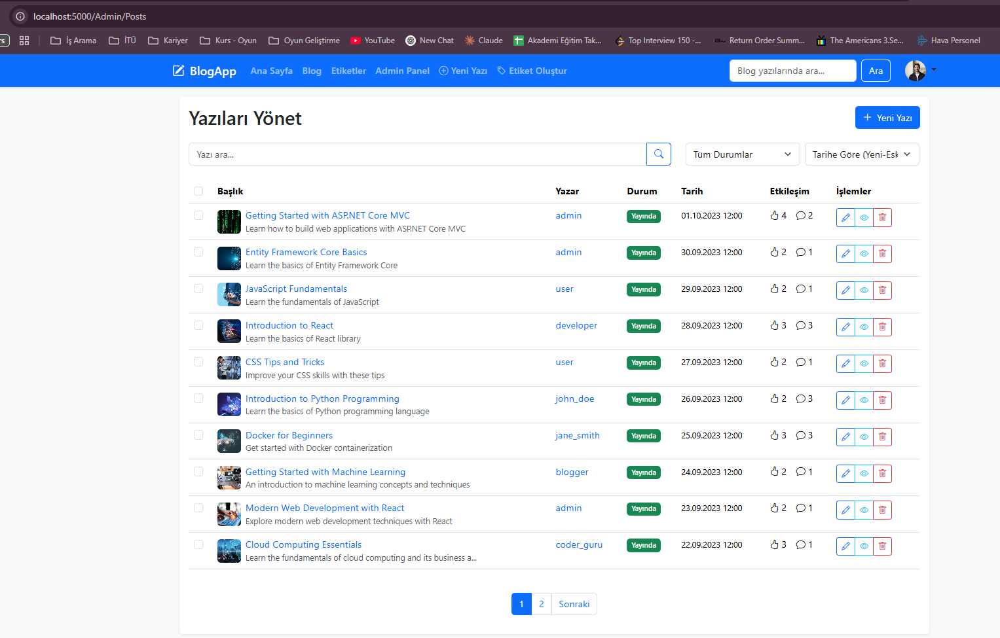
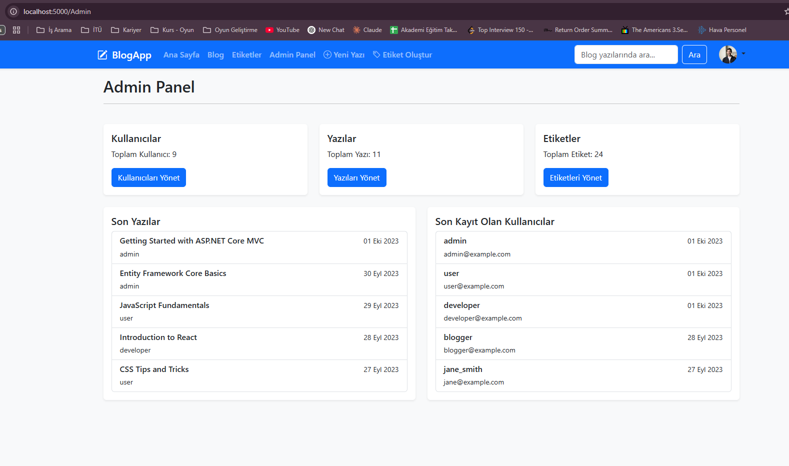
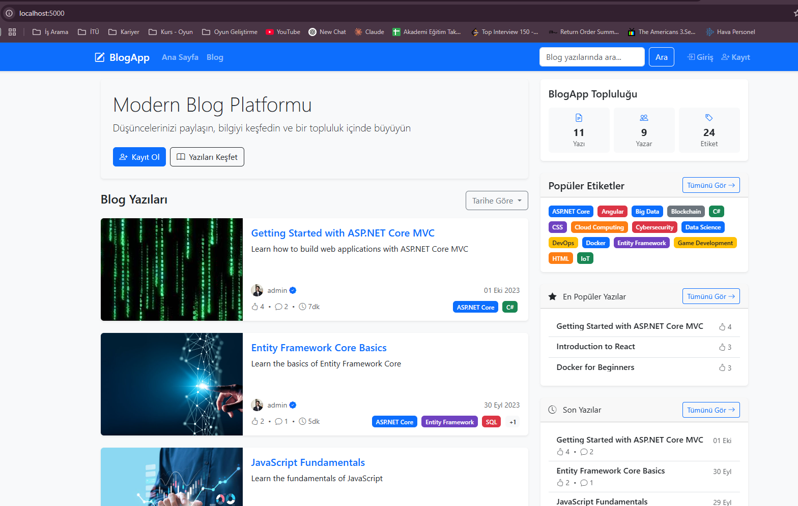

# 📝 BlogApp

<div align="center">
  


</div>

<p align="center">
  
</p>

> A modern, feature-rich blog platform built with ASP.NET Core MVC, featuring a rich text editor, user authentication, tag-based categorization, and a responsive design optimized for all devices.

<p align="center">
  <a href="#-key-features">Key Features</a> •
  <a href="#%EF%B8%8F-technology-stack">Technology Stack</a> •
  <a href="#-architecture">Architecture</a> •
  <a href="#-getting-started">Getting Started</a> •
  <a href="#-screenshots">Screenshots</a> •
  <a href="#-security">Security</a> •
  <a href="#-performance">Performance</a> •
  <a href="#-contributing">Contributing</a> •
  <a href="#-license">License</a>
</p>

*This project was developed as part of the Doğuş Teknoloji Bootcamp training program, demonstrating practical implementation of modern web development technologies and best practices in ASP.NET Core MVC.*

## ✨ Key Features

### Core Features
- **Authentication System** - User registration, login, profile management with secure authentication
- **Blog Management** - Create, edit, publish, archive, and delete blog posts with media support
- **Interactive Comments** - AJAX-powered comment system
- **Tag-based Organization** - Color-coded tags for content categorization
- **Responsive Design** - Seamless experience across all devices

### Admin Features
- **Content Management** - Post approval, editing, and moderation capabilities
- **User Management** - Manage user accounts and permissions
- **Tag Management** - Create, edit, and customize tag categories

### Planned Enhancements
- **Editor Improvements** - More robust text editing capabilities, better media handling
- **LaTeX Support** - For mathematical equation rendering
- **Character Count** - Live word/character count during content creation
- **Content Limits** - Configurable character limits for titles and descriptions
- **Modern Editor UI** - Enhanced editor interface with better formatting controls

## 🛠️ Technology Stack

### Backend
- **ASP.NET Core MVC 7.0** - Modern web framework
- **Entity Framework Core** - ORM for database operations
- **SQLite** - Lightweight database for data storage
- **Identity System** - Authentication implementation

### Frontend
- **Bootstrap 5.3** - Responsive UI components
- **jQuery** - DOM manipulation and AJAX requests
- **CKEditor** - Rich text editing capabilities
- **JavaScript** - Enhanced client-side functionality

### Security
- **CSRF Protection** - Anti-forgery tokens
- **Input Validation** - Server-side and client-side validation
- **Content Sanitization** - HTML sanitization for user input
- **Authentication** - Secure cookie-based authentication

## 🏗 Architecture

The application follows a clean, layered architecture pattern:

```
BlogApp/
├── Controllers/         # Request handling and business logic
├── Models/              # View models and data transfer objects
├── Views/               # Razor views for UI rendering
├── Entity/              # Domain models and entities
├── Data/                # Data access layer
│   ├── Abstract/        # Repository interfaces
│   └── Concrete/        # Repository implementations
├── Services/            # Business services and utilities
├── Helpers/             # Helper classes and extensions
├── Middleware/          # Custom middleware components
├── wwwroot/             # Static files (CSS, JS, images)
└── Tests/               # Unit and integration tests
```

### Design Patterns
- **Repository Pattern** - Data access abstraction
- **Dependency Injection** - Loose coupling between components
- **MVC Architecture** - Separation of concerns

## 🚀 Getting Started

### Prerequisites

- [.NET SDK 7.0](https://dotnet.microsoft.com/download/dotnet/7.0) or later
- [Visual Studio 2022](https://visualstudio.microsoft.com/) / [VS Code](https://code.visualstudio.com/) with C# extension
- [Git](https://git-scm.com/downloads) for version control

### Installation

1. **Clone the repository:**
   ```bash
   git clone https://github.com/yourusername/BlogApp.git
   cd BlogApp
   ```

2. **Restore dependencies:**
   ```bash
   dotnet restore
   ```

3. **Create and update the database:**
   ```bash
   dotnet ef database update
   ```

4. **Run the application:**
   ```bash
   dotnet run
   # or
   dotnet watch run  # For hot reload during development
   ```

5. **Access the application:**
   Navigate to `https://localhost:5001` or `http://localhost:5000` in your browser.

### Default Credentials

After initialization, the following accounts will be available:

| Role  | Email              | Password  | Capabilities                         |
|-------|--------------------|-----------|------------------------------------|
| Admin | admin@example.com  | admin123  | Full access to all features         |
| User  | user@example.com   | user123   | Create/edit posts, comment          |

## 📸 Screenshots

<div align="center">
  
  
</div>

<div align="center">
  
  
</div>

## 🔒 Security

BlogApp implements multiple layers of security:

- **Sanitized User Content** - Input sanitization to prevent XSS attacks
- **CSRF Protection** - All forms include anti-forgery tokens
- **Secure Authentication** - Cookie-based authentication with proper configuration
- **Authorization Policies** - Role-based access control
- **Input Validation** - Client and server-side validation
- **Secure File Uploads** - Content-type validation and size restrictions

## ⚡ Performance

The application is optimized for performance:

- **Async/Await Pattern** - Non-blocking I/O operations
- **Entity Framework Optimizations** - Efficient database queries
- **AJAX Operations** - Smooth user experience without full page reloads
- **Pagination** - Efficient data retrieval for large datasets
- **Responsive Design** - Fast loading on mobile devices

## 🔮 Future Improvements

Planned features for future iterations:

- **Enhanced Rich Text Editor** - More robust formatting options and controls
- **LaTeX Support** - Mathematical equation rendering
- **Image Resizing** - Better image handling and placement
- **Character and Word Counter** - Live count during editing
- **Content Limits** - Character limits for titles and descriptions
- **YouTube Embedding** - Better video embedding capabilities
- **Modern Editor UI** - More intuitive content creation experience
- **Dark/Light Theme** - User preference for interface theme

## 🤝 Contributing

Contributions are welcome! Please check out our contribution guidelines.

## 📄 License

This project is licensed under the MIT License - see the LICENSE file for details.

## 🙏 Acknowledgements

- **Doğuş Teknoloji** for the Bootcamp opportunity and mentorship
- **Bootstrap Team** for the excellent UI framework
- **Microsoft** for ASP.NET Core and related technologies
- **NuGet Package Authors** for the incredible tools that made this project possible

---

<div align="center">
  <p>&copy; 2025 BlogApp Team</p>
</div>

